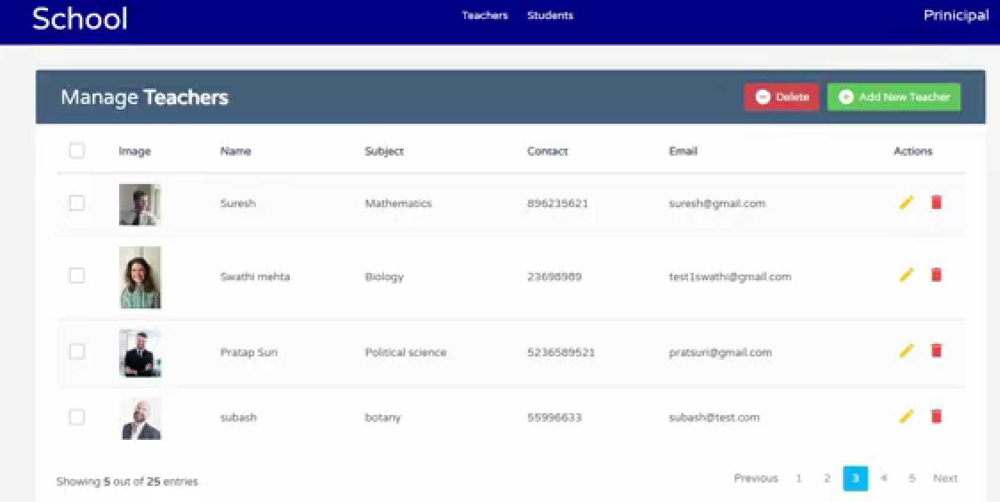
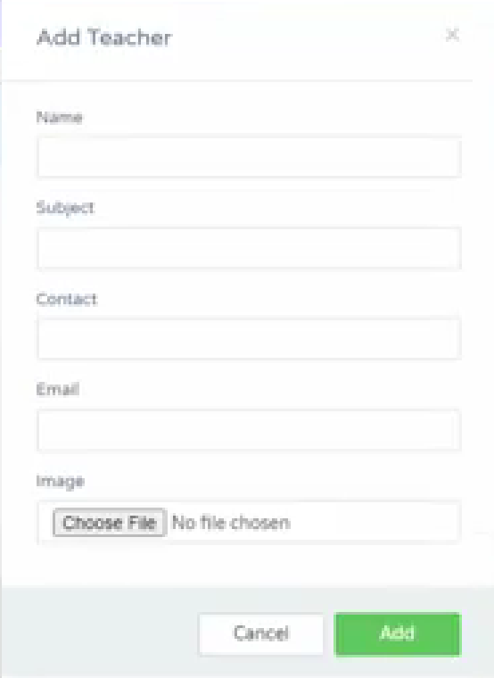

# 🏫 School Management System (Django)

A web-based School Management System built using Django that allows administrators to manage teacher records efficiently. The application supports full CRUD operations with a clean and user-friendly interface.

---

## 🚀 Features

* ➕ Add new teachers
* 📋 View teacher records
* ✏️ Update teacher details
* ❌ Delete teacher records
* 🖼️ Upload teacher images
* 📊 Responsive and clean UI

---

## 🛠️ Tech Stack

* **Backend:** Django (Python)
* **Frontend:** HTML, CSS, Bootstrap
* **Database:** SQLite

---

## 📸 Screenshots

### 📋 Teacher Management (Database Records)



### ➕ Add New Teacher Form



---

## ⚙️ Installation & Setup

Follow these steps to run the project locally:

```bash
# Clone the repository
git clone https://github.com/Guruvinay18/Django-Project.git

# Navigate to project folder
cd Django-Project

# Create virtual environment (optional)
python -m venv venv

# Activate virtual environment
venv\Scripts\activate   # Windows

# Install dependencies
pip install -r requirements.txt

# Apply migrations
python manage.py migrate

# Run the server
python manage.py runserver
```

---

## 📌 Usage

* Open browser and go to: `http://127.0.0.1:8000/`
* Use the interface to manage teacher records
* Perform Create, Read, Update, and Delete operations

---

## 🎯 Key Highlights

✔ Full CRUD functionality implemented
✔ Clean UI with Bootstrap
✔ Image upload feature included
✔ Real-time database interaction

---

## 🔮 Future Improvements

* Student management module
* Deployment on cloud (AWS / Render)

---

## 👨‍💻 Author

**Guru Vinay**
GitHub: https://github.com/Guruvinay18

---
 
